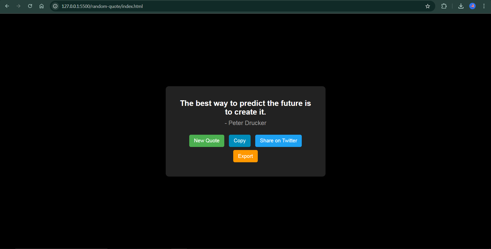
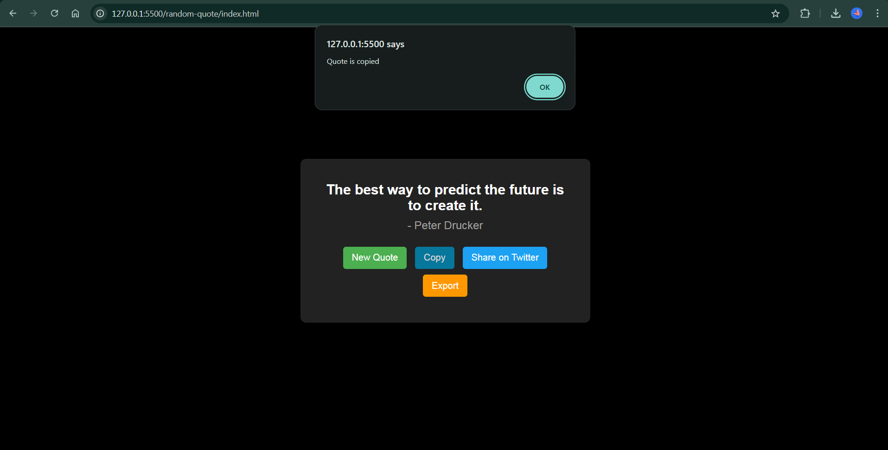
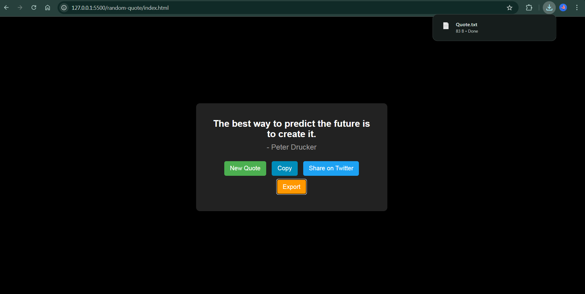
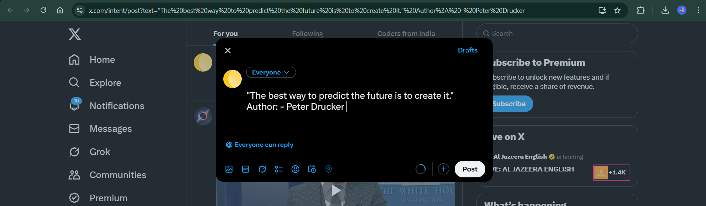

# 📜 Random Quote Generator

A simple web application that fetches and displays a random quote. Users can generate new quotes, copy them, share them on Twitter, and even export them as a text file.

---

## 🌟 Features

- Fetch a random quote from an API  
- Display the quote and author on the page  
- "New Quote" button to fetch another quote  
- "Copy to Clipboard" button. It copies both Quote and Author name  
- "Share on Twitter" button  
- **Bonus:** Export the quote as a `.txt` file  

---

## 🖼️ Screenshots

### Home Page  

### Copy to Clipboard  

### Export

### Share  

---

## 🚀 Live Demo
🔗 **[Click here to try the app](https://random-quote-generate01.vercel.app/)**

---

## How to Use

1. **Click "New Quote"** to fetch a random quote.  
2. **Click "Copy"** to copy the quote to your clipboard.  
3. **Click "Share on Twitter"** to share the quote on Twitter.  
4. **Click "Export"** to download the quote as a text file.  

---

## 🛠️ Technologies Used

- HTML, CSS, JavaScript  
- Fetch API
- Freeapi - to fetch Random Quotes  
- Twitter Intent API (for sharing quotes)  
- Blob & createObjectURL (for exporting quotes)
